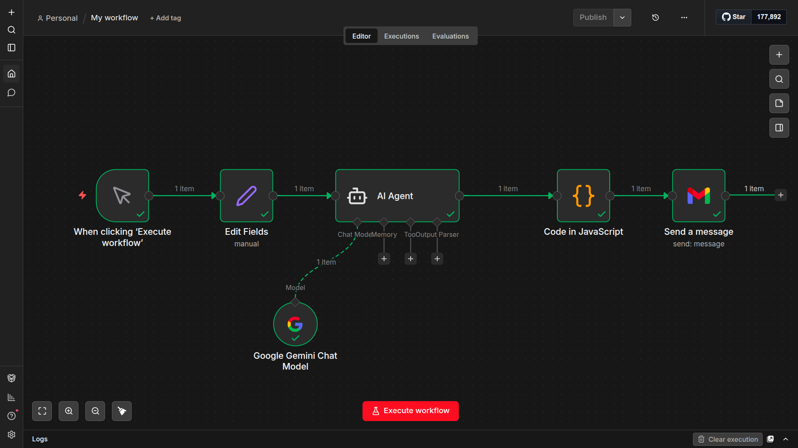
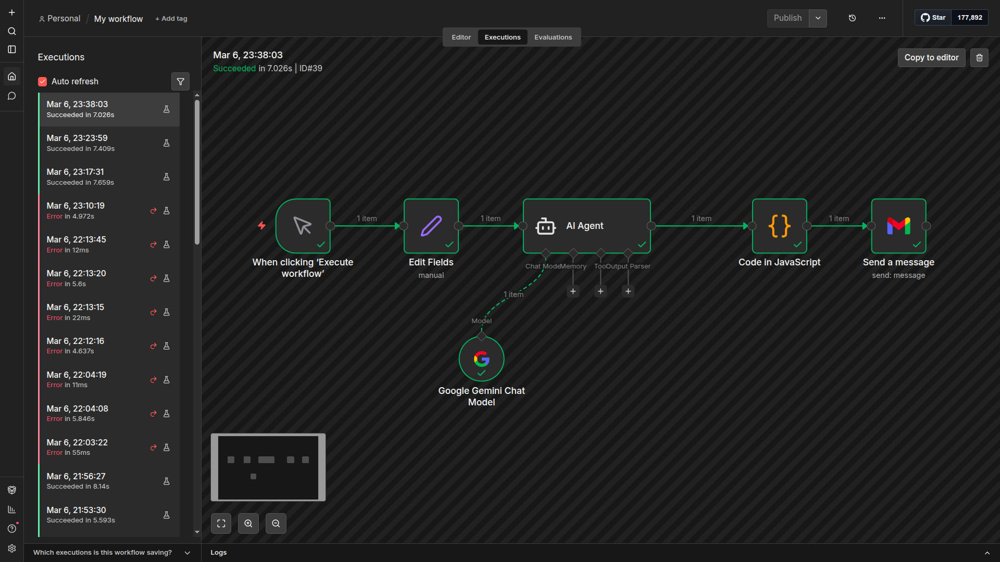
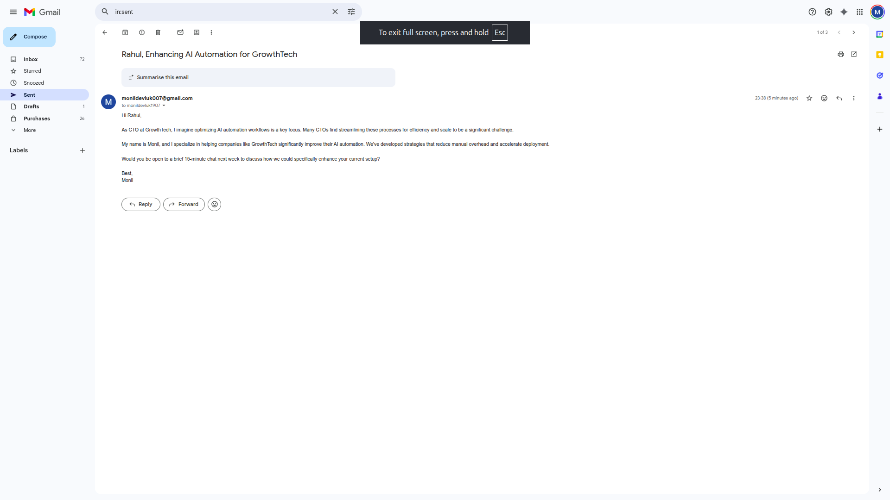

# AI Cold Email Automation System

An AI-powered outreach automation workflow built using **n8n, Google Gemini API, and Gmail** to automatically generate and send personalized cold emails.

This project demonstrates how large language models can be integrated into automation pipelines to streamline marketing outreach and reduce manual work.

---

# Project Overview

Cold outreach is a common process in marketing and sales teams, but writing personalized emails manually is time-consuming.

This project automates the process by using an AI model to generate personalized cold emails based on lead information and sending them automatically using Gmail.

The workflow is implemented in **n8n**, an open-source automation platform.

---

# Workflow Architecture

Lead Data → AI Email Generation → JSON Parsing → Gmail Sending

Step-by-step pipeline:

1. Lead information is provided (name, company, role, pain point)
2. Google Gemini generates a personalized cold email
3. A JavaScript node parses the structured JSON response
4. Gmail node sends the email automatically

---

# Example Generated Email

Subject: Improving AI Workflows at GrowthTech

Hi Rahul,

As CTO at GrowthTech, you're likely focused on optimizing AI automation workflows.

I'm Monil from AIFlow. We help companies streamline AI deployment pipelines, reducing bottlenecks and accelerating delivery.

Would you be open to a brief 15-minute conversation next week to explore whether this could benefit GrowthTech?

Best,
Monil

---

# Tech Stack

* n8n (workflow automation)
* Google Gemini API
* Gmail API
* JavaScript
* GitHub

---

# Repository Structure

```
ai-cold-email-automation
│
├ workflow
│   └ cold_email_workflow.json
│
├ screenshots
│   ├ workflow.png
│   ├ execution.png
│   └ email_result.png
│
└ README.md
```

---

# Screenshots

## n8n Workflow


## Workflow Execution


## Generated Email Result


---

# Key Features

* AI-generated personalized cold emails
* Automated workflow using n8n
* Structured JSON output from LLM
* Automated email sending via Gmail
* JavaScript parsing for AI response formatting

---

# Future Improvements

* Google Sheets integration for automated lead ingestion
* Follow-up email automation
* Campaign logging and tracking
* Subject line A/B testing
* Lead data enrichment for deeper personalization
* Campaign performance analytics

---

# Use Case

This system demonstrates how AI-powered automation can help marketing teams:

* automate cold outreach
* generate personalized messages at scale
* reduce manual email writing
* streamline marketing workflows

---

# Author

Monil
Information Technology Engineering Student
AI Automation & Applied AI Systems
